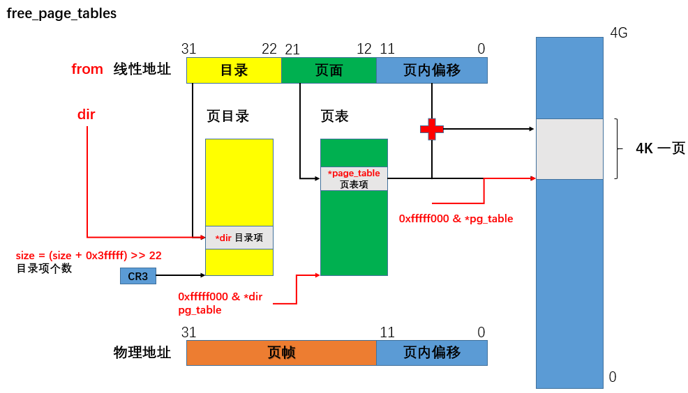
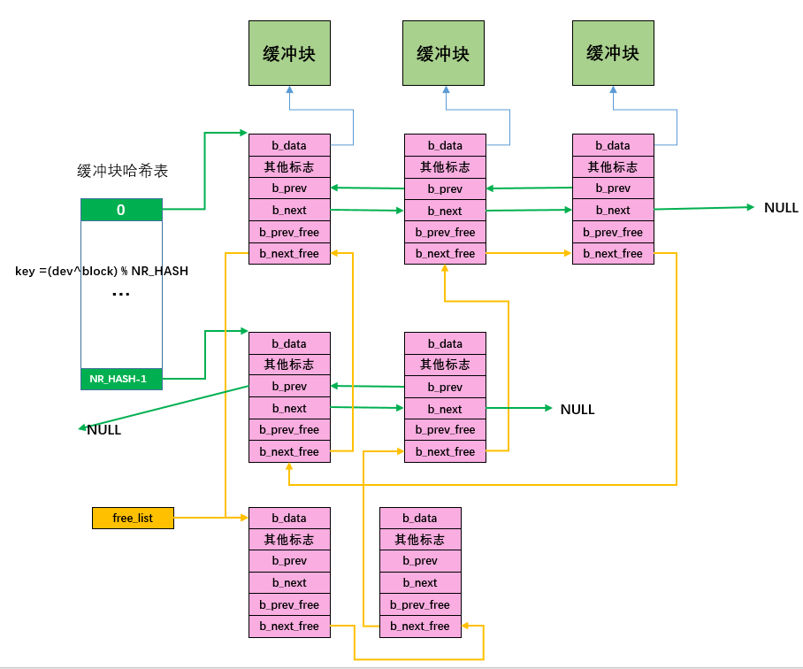
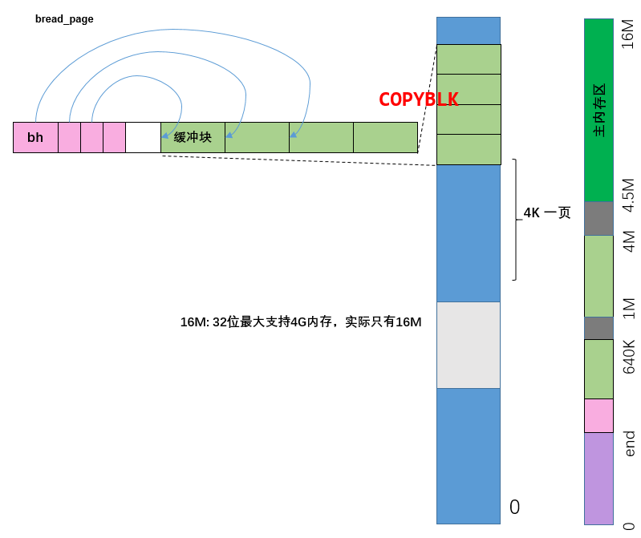

- linux-内存管理：[fork的黑科技，它到底做了个啥，源码级分析linux内核的内存管理](https://blog.csdn.net/qq_41565920/article/details/129353386?csdn_share_tail=%7B%22type%22%3A%22blog%22%2C%22rType%22%3A%22article%22%2C%22rId%22%3A%22129353386%22%2C%22source%22%3A%22qq_41565920%22%7D)

- linux的缓冲区设计：[buffer它到底做了个啥，源码级分析linux内核的文件系统的缓冲区](https://blog.csdn.net/qq_41565920/article/details/129370299?spm=1001.2014.3001.5502)

todo：

- linux的文件系统设计

- linux的进程调度设计